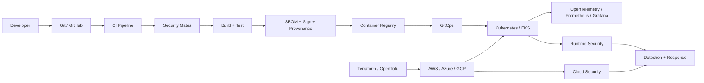

# DevOps • Cloud • DevSecOps Roadmap

A beginner-friendly, production-oriented learning path for **DevOps, Cloud, Kubernetes, DevSecOps, Cloud Security, GitOps, Observability, and Platform Engineering**.

> **Learn → Understand → Implement → Secure → Operate → Explain**

This repository is designed for college students, freshers, career switchers, and engineers who want a structured path from fundamentals to advanced cloud-native engineering.

## 🎯 What this repository covers

| Level | Focus |
|---|---|
| 🟢 Beginner | Linux, networking, Git, scripting, YAML/JSON, DevOps fundamentals |
| 🟡 Intermediate | Docker, CI/CD, AWS, Terraform/OpenTofu, Kubernetes, Helm |
| 🔴 Advanced | GitOps, DevSecOps, cloud security, supply-chain security, observability |
| 🟣 Professional | Platform engineering, policy-as-code, runtime security, multi-cluster, advanced cloud-native architecture |
| ⚫ Interview | Concepts, architecture, troubleshooting, scenario-based questions, follow-ups |

## 🗺️ Learning path

```text
FOUNDATIONS
   ↓
DEVOPS FUNDAMENTALS
   ↓
CONTAINERS
   ↓
CLOUD
   ↓
INFRASTRUCTURE AS CODE
   ↓
KUBERNETES
   ↓
CI/CD + GITOPS
   ↓
DEVSECOPS + SUPPLY CHAIN SECURITY
   ↓
CLOUD SECURITY
   ↓
OBSERVABILITY
   ↓
PLATFORM ENGINEERING
   ↓
ADVANCED CLOUD-NATIVE
   ↓
PROJECTS + INTERVIEWS
```

## 📚 Repository map

| Directory | What you learn |
|---|---|
| [`00-foundations`](./00-foundations/) | Linux, networking, Git, scripting, YAML/JSON |
| [`01-devops-fundamentals`](./01-devops-fundamentals/) | DevOps, CI/CD, automation, artifacts |
| [`02-containers`](./02-containers/) | Docker, images, registries, container security |
| [`03-cloud`](./03-cloud/) | AWS first, plus Azure/GCP concepts |
| [`04-infrastructure-as-code`](./04-infrastructure-as-code/) | Terraform, OpenTofu, Ansible, policy-as-code |
| [`05-kubernetes`](./05-kubernetes/) | Kubernetes from fundamentals to production |
| [`06-gitops`](./06-gitops/) | Argo CD, Flux, progressive delivery |
| [`07-devsecops`](./07-devsecops/) | SAST, SCA, secrets, IaC, container and DAST security |
| [`08-supply-chain-security`](./08-supply-chain-security/) | SBOM, signing, provenance, verification |
| [`09-cloud-security`](./09-cloud-security/) | AWS security, Kubernetes security, Zero Trust, response |
| [`10-observability`](./10-observability/) | Metrics, logs, traces, OpenTelemetry |
| [`11-platform-engineering`](./11-platform-engineering/) | IDPs, Backstage, golden paths, platform security |
| [`12-advanced-cloud-native`](./12-advanced-cloud-native/) | Cilium, service mesh, multi-cluster, chaos, AI infrastructure |
| [`13-projects`](./13-projects/) | Hands-on projects from beginner to advanced |
| [`14-interview-preparation`](./14-interview-preparation/) | Technical + scenario + troubleshooting interviews |
| [`resources`](./resources/) | Official docs, labs, books, courses and communities |

## 🔥 Technology philosophy

“Latest” does **not** mean collecting every tool released last Tuesday. This roadmap separates technologies into:

- 🟢 **Core / Production:** skills with broad industry relevance
- 🔵 **Modern / High-growth:** technologies increasingly important in cloud-native environments
- 🟣 **Advanced / Specialized:** valuable after fundamentals are solid
- 🧪 **Emerging:** technologies worth tracking and experimenting with

The ecosystem changes quickly, so technology recommendations should be reviewed regularly rather than pretending this markdown file has achieved immortality.

See [`technology-matrix.md`](./technology-matrix.md).

## 🧩 Topic learning template

Each major topic should answer:

1. 💡 What is it?
2. 🎯 Why does it exist?
3. 🧠 Core concepts
4. 🔵 Architecture and workflow
5. 🟢 Beginner concepts
6. 🟡 Intermediate concepts
7. 🔴 Advanced concepts
8. 🟣 Security considerations
9. 🛠️ Hands-on labs
10. 🚨 Troubleshooting
11. ⚫ Interview questions
12. 📚 Official resources

## 🏗️ How everything fits together



## 🧪 Project ladder

### 🟢 Beginner
- Linux server deployment
- Git branching workflow
- Dockerize a Flask application
- GitHub Actions CI
- Static website deployment
- AWS EC2 deployment
- Terraform VPC

### 🟡 Intermediate
- Three-tier AWS architecture
- Docker + CI/CD
- Kubernetes application deployment
- Terraform + AWS
- Argo CD GitOps
- Prometheus + Grafana
- Kubernetes security policies

### 🔴 Advanced
- Production-style AWS EKS platform
- Secure DevSecOps supply chain
- Cloud-native security platform
- Internal Developer Platform
- Multi-cluster platform with observability and security

## ⚫ Interview preparation

The interview section is deliberately more than a list of definitions. Prepare to:

- explain concepts simply
- draw architectures
- troubleshoot failures
- compare technologies
- justify design decisions
- discuss security trade-offs
- explain what you personally implemented
- answer follow-up questions without hiding behind buzzwords

Start with [`14-interview-preparation/`](./14-interview-preparation/).

## 📈 Suggested weekly study cycle

```text
Day 1 → Learn the concept
Day 2 → Read official documentation
Day 3 → Build a small lab
Day 4 → Break it intentionally
Day 5 → Troubleshoot and document
Day 6 → Build an interview explanation
Day 7 → Review + teach the concept
```

## 🤝 Contribution

This is intended to remain a living learning resource. Corrections, examples, labs, diagrams, interview questions, and updated technology references are welcome.

See [`CONTRIBUTING.md`](./CONTRIBUTING.md).

## 📜 License

Educational content is provided under the MIT License. Individual third-party trademarks and technologies remain the property of their respective owners.
